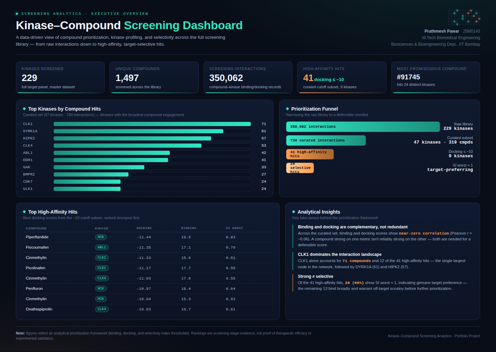

# Kinase–Compound Screening Dashboard

A single-page analytics dashboard summarizing a kinase–compound screening dataset: library scale, top kinases, a prioritization funnel, high-affinity hits, and selectivity insights.

**[View the live dashboard](https://YOUR-USERNAME.github.io/kinase-screening-dashboard/)** *(enable GitHub Pages — see below)*



## What's here

| File | Description |
|---|---|
| `index.html` | The dashboard — pure HTML/CSS/JS, no build step, no dependencies |
| `data/kinase_summary.csv` | Compounds screened per kinase (46 kinases) |
| `data/compound_summary.csv` | Kinases hit per compound (170 compounds) |
| `data/curated_interactions.csv` | Curated compound–kinase interactions with binding/docking values (730 rows) |
| `data/high_affinity_hits.csv` | High-affinity subset, docking ≤ −10, with selectivity index (41 hits) |

## Key figures

- **229** kinases screened, **1,497** unique compounds, **350,062** total screening interactions in the master library
- **CLK1** is the most engaged kinase (71 compounds), followed by DYRK1A (61) and HIPK2 (57)
- Compound **#91745** is the most promiscuous, binding 24 distinct kinases
- **41** high-affinity hits (docking ≤ −10 kcal/mol) across 9 kinases; **28 of 41 (68%)** show SI worst < 1, indicating genuine target selectivity rather than broad off-target binding
- Binding and docking scores show near-zero correlation (Pearson r ≈ −0.06) across the curated set — the two metrics are complementary, not interchangeable

## Running locally

No build tools needed. Clone the repo and open the file directly:

```bash
git clone https://github.com/YOUR-USERNAME/kinase-screening-dashboard.git
cd kinase-screening-dashboard
open index.html   # or just double-click it
```

## Deploying to GitHub Pages

1. Push this repo to GitHub.
2. Go to **Settings → Pages**.
3. Under **Source**, choose the `main` branch and `/ (root)` folder.
4. Save — your dashboard will be live at `https://YOUR-USERNAME.github.io/kinase-screening-dashboard/` within a minute or two.

## Data provenance

Figures are derived from a kinase–compound screening dataset processed in Excel and Python (pandas), following a documented cleaning and multi-parameter prioritization workflow (binding value, docking value, and selectivity index). Rankings reflect a screening-stage analytical framework and are not evidence of therapeutic efficacy or experimental validation.

## License

MIT — see [`LICENSE`](LICENSE).
